# Diseño de base de datos del LIS HISLIS

## Objetivo

Este documento propone el modelo de datos objetivo para evolucionar HISLIS hacia un LIS modular, auditable y preparado para operaciones clínicas, inventario, caja, finanzas y dashboard gerencial.

## Principios de diseño

1. Usar claves foráneas reales.
2. Usar índices para filtros frecuentes y relaciones críticas.
3. Usar `DECIMAL` para cantidades monetarias, costos y cantidades de inventario que requieran precisión.
4. No usar `float` para dinero ni inventario valorizado.
5. Evitar enums MySQL para catálogos configurables.
6. Mantener kardex inmutable para inventario.
7. Mantener saldos transaccionales para consultas rápidas de stock.
8. Usar JSON solo cuando aporte flexibilidad y complementar con filas normalizadas para consultas.
9. Conservar historial y versiones en resultados, reportes y plantillas.
10. Diseñar idempotencia para consumos automáticos y operaciones financieras.

## Tablas existentes relevantes

El repositorio contiene actualmente:

- `settings`
- `areas`
- `users`
- `roles`
- `permissions`
- `model_has_roles`
- `model_has_permissions`
- `role_has_permissions`
- `patients`
- `templates`
- `specialty_labs`
- `lab_exams`
- `services`
- `bundles`
- `bundle_items`
- `appointments`
- `vouchers`
- `order_items`
- `lab_results`
- `speciality_results`
- `providers`
- `products`
- `warehouses`
- `inventories`
- `stock_movements`
- `triages`

Estas tablas pueden servir como punto de partida, pero no cubren completamente los requerimientos del LIS final.

## Modelo propuesto por módulos

### Administración

#### `branches`

Sedes del laboratorio.

Campos sugeridos:

- `id`
- `code`
- `name`
- `address`
- `phone`
- `email`
- `status`
- timestamps

Índices:

- único `code`
- índice `status`

#### `laboratory_areas`

Áreas técnicas de laboratorio.

Campos:

- `id`
- `code`
- `name`
- `description`
- `status`
- timestamps

#### `user_branch_access`

Acceso de usuarios a sedes.

Campos:

- `user_id`
- `branch_id`
- `is_default`
- timestamps

Clave única:

- `user_id`, `branch_id`

#### `user_area_access`

Acceso de usuarios a áreas.

Campos:

- `user_id`
- `laboratory_area_id`
- `is_default`
- timestamps

Clave única:

- `user_id`, `laboratory_area_id`

#### `audit_logs`

Auditoría transversal.

Campos:

- `id`
- `user_id` nullable
- `action`
- `auditable_type`
- `auditable_id`
- `old_values` JSON nullable
- `new_values` JSON nullable
- `ip_address`
- `user_agent`
- `reason` nullable
- `created_at`

Índices:

- `user_id`, `created_at`
- `auditable_type`, `auditable_id`
- `action`, `created_at`

### Pacientes y clientes

#### `document_types`

Catálogo de tipos de documento.

#### `patients`

Se recomienda extender la tabla actual o crear una migración de alteración controlada.

Campos objetivo:

- `document_type_id`
- `document_number`
- `first_name`
- `last_name`
- `birth_date`
- `sex`
- `phone`
- `email`
- `address`
- `clinical_history_number`
- `origin`
- `observations`
- `status`

Clave única sugerida:

- `document_type_id`, `document_number`

#### `requesting_physicians`

Médicos solicitantes.

#### `physician_specialties`

Especialidades médicas.

#### `customers`

Clientes, empresas, clínicas o convenios.

#### `customer_price_lists` y `customer_price_list_items`

Tarifarios por cliente.

### Catálogo de laboratorio

#### `sample_types`

Tipos de muestra.

#### `container_types`

Recipientes.

#### `measurement_units`

Unidades de medida.

#### `analytical_principles`

Principios analíticos: CLIA, ECLIA, ELISA, PCR, etc.

#### `manufacturers`

Fabricantes.

#### `equipment`

Equipos.

#### `exams`

Exámenes.

Campos:

- `id`
- `code`
- `name`
- `description`
- `default_turnaround_minutes`
- `status`
- timestamps

#### `exam_area`

Relación N:N entre exámenes y áreas.

#### `exam_sample_type`

Relación N:N entre exámenes y tipos de muestra.

#### `exam_methods`

Métodos por examen.

Campos:

- `exam_id`
- `analytical_principle_id`
- `name`
- `equipment_id`
- `manufacturer_id`
- `sample_type_id`
- `measurement_unit_id`
- `decimals`
- `result_type`
- `analytical_range`
- `detection_limit`
- `is_default`
- `show_on_report`
- `status`

#### `exam_method_reference_ranges`

Rangos de referencia por método.

#### `exam_method_critical_values`

Valores críticos.

#### `profiles` y `profile_exam`

Perfiles de exámenes.

### Plantillas dinámicas

#### `exam_templates`

Plantilla lógica por examen.

#### `exam_template_versions`

Versiones publicables.

Estados:

- `draft`
- `published`
- `retired`

#### `exam_template_sections`

Secciones ordenadas.

#### `exam_template_fields`

Campos dinámicos.

Tipos mínimos:

- `short_text`
- `long_text`
- `integer`
- `decimal`
- `select`
- `radio`
- `multiselect`
- `checkbox`
- `checkbox_group`
- `date`
- `time`
- `positive_negative`
- `reactive_non_reactive`
- `detected_not_detected`
- `present_absent`
- `repeatable_table`
- `calculated`
- `title`
- `separator`
- `observation`
- `file`
- `hidden`

#### `exam_template_field_options`

Opciones para select, radio, multiselect y checkbox_group.

#### `exam_template_rules`

Reglas condicionales seguras, sin ejecutar código arbitrario.

### Órdenes y muestras

#### `laboratory_orders`

Orden clínica central.

Campos:

- `order_number`
- `branch_id`
- `patient_id`
- `requesting_physician_id`
- `customer_id`
- `ordered_at`
- `priority`
- `clinical_information`
- `gross_total`
- `discount_total`
- `net_total`
- `paid_total`
- `balance_total`
- `status`
- `barcode`
- `observations`

#### `laboratory_order_exams`

Exámenes solicitados en una orden.

Campos:

- `laboratory_order_id`
- `exam_id`
- `profile_id` nullable
- `exam_method_id` nullable
- `template_version_id`
- `price`
- `discount`
- `status`

#### `samples`

Muestras.

#### `sample_exam`

Relación entre muestras y exámenes de orden.

#### `sample_events`

Trazabilidad de toma, recepción, rechazo y nueva toma.

### Resultados

#### `results`

Resultado principal por orden-examen.

Campos:

- `laboratory_order_exam_id`
- `exam_id`
- `exam_method_id`
- `template_version_id`
- `structured_result` JSON
- `status`
- `entered_by`
- `validated_by`
- `approved_by`
- fechas

#### `result_values`

Valores normalizados consultables.

Campos:

- `result_id`
- `field_key`
- `field_label`
- `value_text`
- `value_numeric`
- `value_date`
- `unit_id`
- `is_abnormal`
- `is_critical`

#### `result_corrections`

Correcciones auditadas.

#### `reports` y `report_versions`

Informes y versiones imprimibles.

### Microbiología

- `microbiology_cultures`
- `microbiology_isolates`
- `microorganisms`
- `antibiotics`
- `antibiotic_panels`
- `antibiotic_panel_items`
- `antibiograms`
- `antibiogram_results`

### Inventario

#### `inventory_categories`

Categorías configurables.

#### `inventory_products`

Productos e insumos.

#### `inventory_lots`

Lotes.

#### `inventory_balances`

Saldos transaccionales por producto, almacén, lote y ubicación.

Clave única sugerida:

- `product_id`, `warehouse_id`, `lot_id`, `location_id`

#### `inventory_movements`

Cabecera de kardex.

#### `inventory_movement_lines`

Detalle inmutable de movimientos.

### Consumo por prueba

#### `exam_consumable_requirements`

Receta teórica de consumo.

#### `analytical_runs`

Corridas analíticas.

#### `exam_processing_attempts`

Intentos de procesamiento por orden-examen.

#### `exam_consumptions`

Consumo generado por intento o corrida.

#### `exam_consumption_lines`

Detalle de materiales consumidos.

Clave idempotente sugerida:

- `laboratory_order_exam_id`, `processing_attempt_id`, `requirement_version_hash`

### Caja y finanzas

- `cash_registers`
- `cash_sessions`
- `payment_methods`
- `payments`
- `payment_allocations`
- `cash_movements`
- `financial_accounts`
- `financial_categories`
- `financial_movements`
- `financial_periods`
- `monthly_financial_closures`

## Diagrama entidad-relación Mermaid

```mermaid
erDiagram
    USERS ||--o{ USER_BRANCH_ACCESS : has
    USERS ||--o{ USER_AREA_ACCESS : has
    BRANCHES ||--o{ USER_BRANCH_ACCESS : grants
    LABORATORY_AREAS ||--o{ USER_AREA_ACCESS : grants

    PATIENTS ||--o{ LABORATORY_ORDERS : owns
    REQUESTING_PHYSICIANS ||--o{ LABORATORY_ORDERS : requests
    CUSTOMERS ||--o{ LABORATORY_ORDERS : pays_or_refers
    BRANCHES ||--o{ LABORATORY_ORDERS : receives

    LABORATORY_ORDERS ||--o{ LABORATORY_ORDER_EXAMS : contains
    EXAMS ||--o{ LABORATORY_ORDER_EXAMS : ordered
    PROFILES ||--o{ PROFILE_EXAM : groups
    EXAMS ||--o{ PROFILE_EXAM : belongs

    LABORATORY_ORDERS ||--o{ SAMPLES : has
    SAMPLES ||--o{ SAMPLE_EXAM : serves
    LABORATORY_ORDER_EXAMS ||--o{ SAMPLE_EXAM : requires
    SAMPLES ||--o{ SAMPLE_EVENTS : traces

    EXAMS ||--o{ EXAM_METHODS : has
    ANALYTICAL_PRINCIPLES ||--o{ EXAM_METHODS : classifies
    EQUIPMENT ||--o{ EXAM_METHODS : uses
    MEASUREMENT_UNITS ||--o{ EXAM_METHODS : reports
    EXAM_METHODS ||--o{ EXAM_METHOD_REFERENCE_RANGES : defines
    EXAM_METHODS ||--o{ EXAM_METHOD_CRITICAL_VALUES : defines

    EXAMS ||--o{ EXAM_TEMPLATES : has
    EXAM_TEMPLATES ||--o{ EXAM_TEMPLATE_VERSIONS : versions
    EXAM_TEMPLATE_VERSIONS ||--o{ EXAM_TEMPLATE_SECTIONS : contains
    EXAM_TEMPLATE_SECTIONS ||--o{ EXAM_TEMPLATE_FIELDS : contains
    EXAM_TEMPLATE_FIELDS ||--o{ EXAM_TEMPLATE_FIELD_OPTIONS : has
    EXAM_TEMPLATE_VERSIONS ||--o{ EXAM_TEMPLATE_RULES : applies

    LABORATORY_ORDER_EXAMS ||--o{ RESULTS : produces
    RESULTS ||--o{ RESULT_VALUES : normalizes
    RESULTS ||--o{ RESULT_VALIDATIONS : validates
    RESULTS ||--o{ RESULT_CORRECTIONS : corrects
    RESULTS ||--o{ REPORT_VERSIONS : prints

    RESULTS ||--o| MICROBIOLOGY_CULTURES : may_have
    MICROBIOLOGY_CULTURES ||--o{ MICROBIOLOGY_ISOLATES : isolates
    MICROORGANISMS ||--o{ MICROBIOLOGY_ISOLATES : identified
    MICROBIOLOGY_ISOLATES ||--o{ ANTIBIOGRAMS : has
    ANTIBIOGRAMS ||--o{ ANTIBIOGRAM_RESULTS : contains
    ANTIBIOTICS ||--o{ ANTIBIOGRAM_RESULTS : tested

    INVENTORY_CATEGORIES ||--o{ INVENTORY_PRODUCTS : classifies
    INVENTORY_PRODUCTS ||--o{ INVENTORY_LOTS : has
    WAREHOUSES ||--o{ INVENTORY_BALANCES : stores
    INVENTORY_PRODUCTS ||--o{ INVENTORY_BALANCES : balances
    INVENTORY_LOTS ||--o{ INVENTORY_BALANCES : balances
    INVENTORY_PRODUCTS ||--o{ INVENTORY_MOVEMENT_LINES : moves
    INVENTORY_LOTS ||--o{ INVENTORY_MOVEMENT_LINES : moves
    INVENTORY_MOVEMENTS ||--o{ INVENTORY_MOVEMENT_LINES : contains

    EXAM_METHODS ||--o{ EXAM_CONSUMABLE_REQUIREMENTS : requires
    INVENTORY_PRODUCTS ||--o{ EXAM_CONSUMABLE_REQUIREMENTS : consumed
    LABORATORY_ORDER_EXAMS ||--o{ EXAM_PROCESSING_ATTEMPTS : processed
    EXAM_PROCESSING_ATTEMPTS ||--o{ EXAM_CONSUMPTIONS : generates
    EXAM_CONSUMPTIONS ||--o{ EXAM_CONSUMPTION_LINES : contains
    INVENTORY_MOVEMENT_LINES ||--o{ EXAM_CONSUMPTION_LINES : linked

    CASH_REGISTERS ||--o{ CASH_SESSIONS : opens
    USERS ||--o{ CASH_SESSIONS : cashier
    LABORATORY_ORDERS ||--o{ PAYMENTS : paid_by
    CASH_SESSIONS ||--o{ PAYMENTS : receives
    PAYMENT_METHODS ||--o{ PAYMENTS : uses
    CASH_SESSIONS ||--o{ CASH_MOVEMENTS : records

    FINANCIAL_PERIODS ||--o{ MONTHLY_FINANCIAL_CLOSURES : closes
    FINANCIAL_CATEGORIES ||--o{ FINANCIAL_MOVEMENTS : classifies
    BRANCHES ||--o{ FINANCIAL_MOVEMENTS : belongs

    USERS ||--o{ AUDIT_LOGS : performs
```

## Orden recomendado de migraciones

1. Administración: sedes, áreas LIS, accesos por sede/área y auditoría.
2. Catálogos base: documentos, muestras, recipientes, unidades, principios, fabricantes, equipos, motivos de rechazo, medios de pago y tipos de movimiento.
3. Seguridad: roles, permisos, Policies y seeders.
4. Pacientes, médicos solicitantes y clientes.
5. Catálogo de exámenes, métodos, rangos y perfiles.
6. Plantillas dinámicas versionadas.
7. Órdenes y muestras.
8. Resultados, validaciones, correcciones e informes.
9. Microbiología.
10. Inventario: productos, lotes, almacenes, saldos y kardex.
11. Consumos por prueba y corridas analíticas.
12. Caja y pagos.
13. Finanzas operativas y cierres mensuales.
14. Inventario físico y dashboard gerencial.

## Riesgos de datos

1. Migrar `vouchers` a órdenes clínicas requiere decisión de negocio.
2. Cambiar `patients.dni` a documento configurable requiere migración cuidadosa.
3. Convertir `templates.schema` a versiones normalizadas requiere compatibilidad temporal.
4. Reemplazar enums actuales por catálogos o constantes debe hacerse sin romper datos existentes.
5. Inventario requiere evitar doble registro entre tablas legacy y nuevas.
